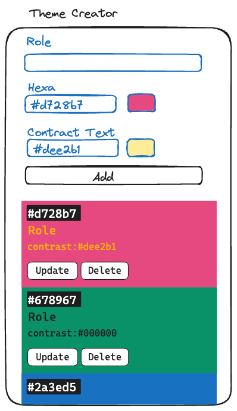

# Todos
## 1 add color

# Recap Project 4: Theme Creator
In this project, we will create an Color Theme Creator app.
Users can add new color theme, edit and delete them. They can also copy the color hexa code of it.

## API

For issue `#7: Fetch API to Check If Contrast Is Okay`, you will be using [are my colors accessible api](https://www.aremycolorsaccessible.com/api-page).